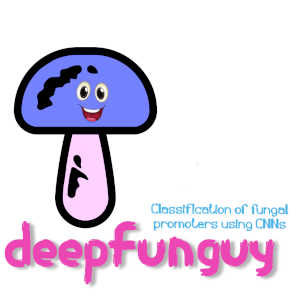
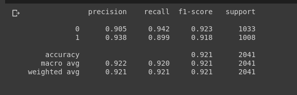

# deepfunguy
## Fungal (Saccharomyces cerevisiae) Promoter / Non Promoter Classification using CNNs

> * Trained on Saccharomyces cerevisiae promoters downloaded from https://epd.epfl.ch//index.php [The Eukaryotic promoter Database]
> * Negative dataset is generated by following the methodology given by https://www.frontiersin.org/articles/10.3389/fgene.2019.00286/ [DeePromoter: Robust Promoter Predictor Using Deep Learning]
> * **Results on the test dataset are as follows:**

